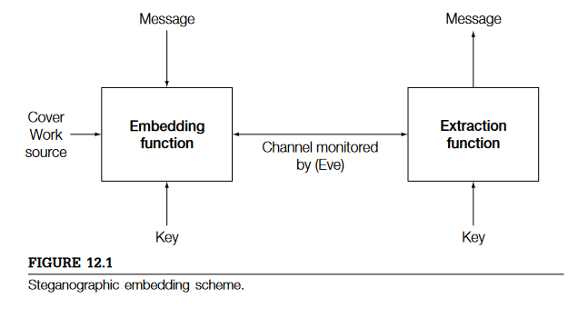

# Esteganografia

La esteganografia es la práctica por la cual, emisor y receptor, son capaces de comunicarse sin que otro interlocturo sea capaz de interceptarlos. Para conseguirlo, se requiere esconder el mensaje dentro de comunicaciones fiables.

Así pues, la capacidad principal de la esteganografia no es mantener un secreto com podria ser la encriptación, sino que el objetivo es la indetectibilidad por un tercero, se trata que ningún tercero sea capaz de saber ni si quiera que está habiendo una comunicación entre dos pares. Por otro lado, el estegoanalisis es la parte que se encarga de detectar si hay comunicaciones ocultes en nuestra red.

A la hora de poder crear un comunicación esteganográfica es imprescindible tener presente, el canal (chanel) por el que se transmitirá la información, el contenedor (cover) donde insertaremos (embed) las comunicaciones ocultas, y las funciones de incrustación y extracción del mensaje.

<picture>
 
</picture>

### Vocabulario básico

Channel: canal, medio.

Warden: Vigilante, forma parte del channel. Es quien intentará capturar nuestros mensajes ocultos, puede ser de carácter pasivo, si no modifica el mensaje, activo, intenta destruir cualquier mensajes incrustado, y malicioso, intenta modificar los mensajes enviados para hacerlos prisioneros.

Cover Work: contenedor inicial

Stego Work: contenedor con mensaje oculto.

## El cover

Actualmente, el concepto de esteganografía está bastante desenvolupado y la mayoría de la gente ya imagina esas imágenes que de forma imperceptible al ojo humano son capaces de adjuntar mensajes ocultos. Pero la esteganografía ha estado siempre presente entre el mundo de la ocultación. Podemos distinguir tres grandes forma de jugar con nuestros *cover* para inserir nuestro mensaje:

**Stego by cover lookup**: Imaginaros por un momento que queremos enviar 10 bits a nuestro receptor sin que el *warden* pueda percibir que hay algún tipo de comunicación oculta. Una primera opció sería la de tener un banco importante de canciones, las cuales nosotros aplicaríamos algorítmos de hashes hasta encontrar con alguna canción donde sus primeros 10 bits coincidieran con los bits que queremos enviar. En este tipo de técnica, los bits que queremos enviar son evidentes, y de forma clara, son los que enviamos. La ocultación viene, puesta que el *warden* no sabe que esa canción forma parte de canal por donde enviamos información oculta. Las opciones son múltiples, lo único importante es que receptor y emisor se deben poner de acuerdo en el momento y el sitio para hacer el envío.

**Stego by cover synthesis**: Otra forma que tenemos para hacer llegar la información oculta es crear *covers* expresos para poder enviar la infomración oculta. Ya no se trata de buscar que hash es igual al mensaje que quiero hacer llegar, sino que aquí crearemos un patrón que emisor y receptor serán capaces de cifrar y descifrar. Un ejemplo ya hecho lo podéis encontrar en la web [SpamMimic](https://www.spammimic.com/), donde podemos crear
Una altra forma que tenim per fer arribar informació oculta és crear *covers* expressos per poder enviar informació oculta. Aquí ja no es tracta de cercar un fitxer amb un hash que sigui igual al missatge que volem enviar, aquí lo i

Es tracta d'un treball amb diverses converses, el emissor seleccionar les línies que vols, i aquest és el missatge enviat. II WW - llibre "Between Silk and Cyanide" i codi "Windswept", british spies. També teim **el programa SpamMimmi* http://www.spammimic.com, codifica un missatge reendreçant missatges spam, ja que la falta de ortografia i gramàtica dels correus spam, permet més modificacions. Un altre exemple és el *data masking*, creen un missatge estadísticament similar a algú, per exemple una cançó, mentre ningú escolti la cançó, ningú es donarà compte.

Code: hola

Dear Decision maker , We know you are interested in 
receiving amazing announcement ! This is a one time 
mailing there is no need to request removal if you 
won't want any more . This mail is being sent in compliance 
with Senate bill 1625 , Title 3 , Section 305 ! THIS 
IS NOT A GET RICH SCHEME . Why work for somebody else 
when you can become rich within 98 months . Have you 
ever noticed how many people you know are on the Internet 
& nearly every commercial on television has a .com 
on in it ! Well, now is your chance to capitalize on 
this . WE will help YOU deliver goods right to the 
customer's doorstep and decrease perceived waiting 
time by 170% ! You are guaranteed to succeed because 
we take all the risk ! But don't believe us . Mrs Anderson 
of Indiana tried us and says "I was skeptical but it 
worked for me" . We assure you that we operate within 
all applicable laws . You will blame yourself forever 
if you don't order now . Sign up a friend and you'll 
get a discount of 10% ! Thank-you for your serious 
consideration of our offer ! 

Code: 1234567

Dear Colleague , Thank-you for your interest in our 
newsletter ! If you no longer wish to receive our publications 
simply reply with a Subject: of "REMOVE" and you will 
immediately be removed from our club . This mail is 
being sent in compliance with Senate bill 2516 ; Title 
7 ; Section 306 . Do NOT confuse us with Internet scam 
artists ! Why work for somebody else when you can become 
rich in 30 DAYS . Have you ever noticed how long the 
line-ups are at bank machines and nobody is getting 
any younger . Well, now is your chance to capitalize 
on this . WE will help YOU deliver goods right to the 
customer's doorstep and decrease perceived waiting 
time by 170% ! You are guaranteed to succeed because 
we take all the risk ! But don't believe us . Mrs Anderson 
of Indiana tried us and says "I was skeptical but it 
worked for me" . We assure you that we operate within 
all applicable laws . You will blame yourself forever 
if you don't order now . Sign up a friend and you'll 
get a discount of 10% ! Thank-you for your serious 
consideration of our offer ! 

**Stego by cover modifications**: És quan l'emissor altera un *cover* per obtenir incrustar un missatge codificat. Quan menys modifiquem, més difícil serà de detectar. Tenim tres tipus de regles per modificar:

- Sequential rule- incrusta els bits de forma seqüencial en una imatge, començant per la fila tal i anant per les columnes.... més fàcil d'implementar i detectar. (13.2.1)

- Pseudo-random rule, creem una regla pseudoaleatòria (PRNG) per anar incrustant en el lloc que toqui. .

- Adaptative selection rule : Va incrustant els bits, segons l'origen de la obra

12.1 - Issues

12.2 - terminologia bàsica

12.3 - evaluació secure LSB - teòric

12.4 - Practical stego schemes

12.5 - embedding proces

1. Escollir l'embolcall

2. Crear els algoritmes d'inserció i extracció, que han de tenir:

   1. Simbol assignment function

   2. The embedding modification

   3. The selection rule

3. Stego key management

### Key stego

L'objectiu de tenir una regla que fa que les adaptacions i les pseudo vagin variant.

També interessant les claus de sessió.

Però també ens pot ajudar a encriptar els missatges

## Notation and terminology

Embeded: `C x K x M -> C`

Extraction: `C -> M`

*K$s$* : És la stego key extreta d'un conjunt de possibles claus *K*.

*M* : El conjunt de missatges possibles a incrustar. *m* el missatge escollit.

*C* : El conjunt de tots els treballs originals. *c* el treball original escollit.

The work *s* = *Emb*(c, K$s$, m)

*Embedding capacity*: És la capacitat total que tenim per incrustar un missatge, es mesura en bits, és log$2$ |M|. Tinc 6 bits, puc fer 64 combinacions diferents de missatges a poder enviar. (2^6 = 64)

*Impact of embedding (or embedding distortion)*:  Es mesura com D(c,s), on D és la distàcnia definida a C. Intenta calcular la diferència entre l'original i el missatge a través de l'error quadràtic mig. Pixel a pixel, es calcula el quadrat de la seva diferència i es fa la mitjana. Quants més pixels poguem posar, més impactarà, però també millorarà la seva *embedding efficiency*.

# Estegoanalisis

L'estegoanalisis és la capacitat de dos dispositius d'enviar-se informació sense ser detectats. No només es tracta que cap intercepto pugui conèixer el missatge que s'envia, sinó que es tracta que ningú sigui conscient que s'ha arribat a enviar un missatge.

L'objectiu d'ocultar comunicacions poden ser variades, però els més comuns tenen relació amb la intel·igència, però també podem trobar altres usos, com per exemple, poder posar comunicacions segures dins de les nostres aplicacions.

-----

Posar teoria del lliber

----
